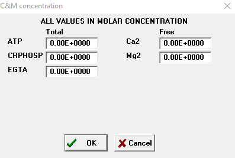
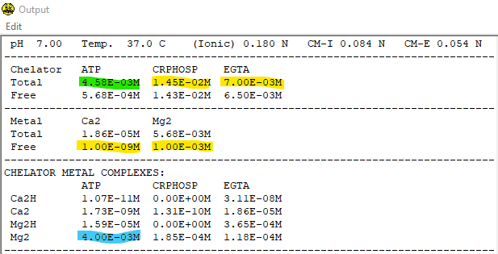
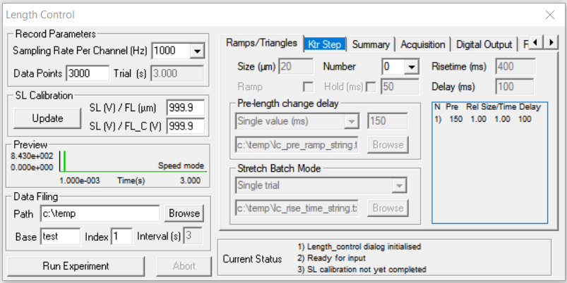
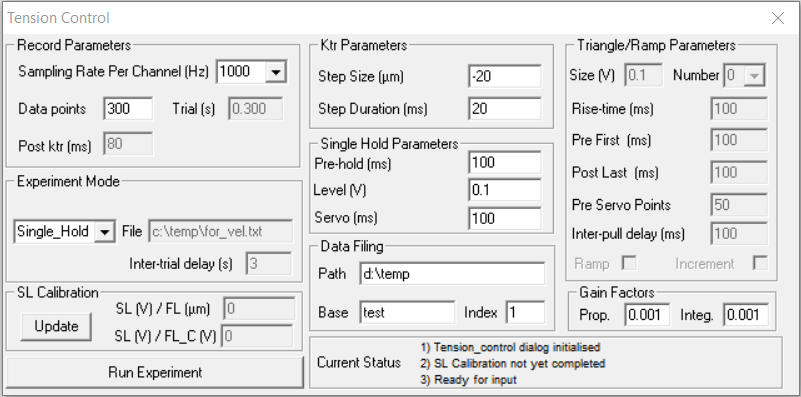
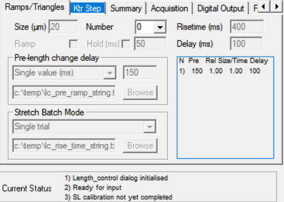
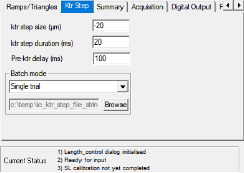
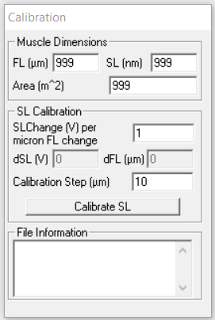

# How-to: Permeabilized Muscle Preparations
## Solutions
### - pCa Solutions
pCa solutions are sets of specialized solutions which are used during permeabilized muscle fiber experiments. The calcium concentration of these solutions often ranges from pCa 9.0 to 4.5 where pCa = -log([Ca2+]). These solutions require tight buffering of calcium and calculation of free ion concentrations while taking chelation and hydration complexes into account.

We use a program called [MaxChelator](https://somapp.ucdmc.ucdavis.edu/pharmacology/bers/maxchelator/) which takes into account complex binding rates, chelation, and hydration complex formation to calculate the total concentration of an ion needed to achieve a desired free ion concentration.

#### MaxChelator
After downloading and installing, open the program and load in a constants file (File>>Open...>>updated_campbell_constants_jun14_2005.TCM). This constant file includes temperature adjustments and binding constants for the various metals and chelators in the solution. Next change the calculation type to "Total" (Calculation>>Total) because we want to calculate the total concentration needed to achieve the desired free concentration. Clicking on the "Free Metal" will open a window where adjustments for Temperature, pH, and ionic strength. Temperature should be set to the temperature you indend to run experiments at while pH and ionic strength is usually 7 and 180 mM, respectively. After setting these parameters, the next window that will open shows the available chelators and metals that you can calculation in your solutions. For pCa solutions we will select the follow then click "Ok":
- ATP
- CRPHOSP
- EGTA
- Ca2
- Mg2

This is where we start tweaking the recipe to generate the desired final free concentrations. For our solutions the following concentrations never change:
- total CRPHOSP = 0.0145 M
- total EGTA = 0.007 M
- free Mg2= 0.001 M

The amount of free calcium required is either 1E-9 M for pCa 9.0 or 3.16E-5 M for pCa 4.5. Total concentration of ATP is variable and depends on the desired calcium concentration, pH, temperature, and other solution variables. Regardless, we aim to have a final MgATP concentration of 4E-3 M. To achieve this we start by assuming a total ATP concentration of 0.00458 M and tweak the total ATP concentration until we get 4E-3 M MgATP. With these values input, click "Ok" and allow to the program to run. A warning about calculations being out of the buffering range may occur. Disregard this dialog box and continue to the generated output text file.

In the above image we can see the MaxChelator output file. The green and yellow highed values reflect the inputs from the previous step. You can see that for the given free Ca2 and Mg2 concentrations we wanted the program has calculated the total Ca2 and Mg2 needed to add to the solution. Additionally, the blue highed value shows the MgATP concentration. with the given the current inputs the MgATP concentration is what we want (4E-3 M). If this value is not the desired MgATP concentration adjust the concentration of total ATP (green highlight). Once you have achieved the desired free and total concention save this output file. This output file will provide you with the total ATP, Creatine phosphate, EGTA, Ca2, and Mg2 molarities you need from which you can work backwards from to determine the mass of each compound you'll need to add to your solutions. Repeat these steps until you have created two recipes: pCa 4.5 and pCa 9.0.
### - Relax
Relax has various ions, calcium chelators, and ATP to minimize contraction and keep the muscle viable for future experimentation. Relax solutions is used when working to isolate muscle bundles and fibers and forms the basis of the skinning solution and storage solution. An example recipe can be found and downloaded [here](https://github.com/Campbell-Muscle-Lab/How-to_Permeabilized_Muscle_Preparations/tree/main/Solutions/Relax).
### - Chemical Permeabilization
Chemical permeabilization, also called chemical skinning, uses Triton X-100 to permeabilize the muscle fiber and allows for tight control of the chemical constituents around the myofilaments within the muscle fiber. Our skinning solution is 3 mL 1% Triton X-100 in 30 mL Relax. An example procedure for preparation and skinning of skeletal muscle fibers can be found [here](https://github.com/Campbell-Muscle-Lab/How-to_Permeabilized_Muscle_Preparations/blob/main/Solutions/Chemical%20Skinning/Skeletal_Muscle_Bundle_Preparation.docx).

## SLControl

SLControl is a free software program designed to run muscle mechanics experiments. A detailed explanation of this software can be found in this [publication](https://journals.physiology.org/doi/full/10.1152/ajpheart.00295.2003?rfr_dat=cr_pub++0pubmed&url_ver=Z39.88-2003&rfr_id=ori%3Arid%3Acrossref.org). To download or view demos of this program, visit the [SLControl website](http://www.uky.edu/~kscamp3/SLControl/).

SLControl can run experiments in two broad categories: length control or tension control. In length control, preset length changes are imposed upon the muscle fiber and the tension recorded. In tension control, the muscle is allowed to shorten isotonically at a preset tension while length is recorded. These modes allow for the creation of pCa-tension curves, force-velocity curves, and other muscle mechanic measurements to be made. Examples of the length and tension control user interfaces are below.

In length control you can generate and run simple protocols within the program itself which can include ramps, holds, and ktr maneuver. Additionally, experimenters can generate freeform files to run custom protocols. These options for the ramp/hold (left) and ktr maneuver  (right) are displayed below.

Each experiment also has an area to input fiber dimensions and file metadata. The fiber dimensions can be used to automatically calculate percent length changes and convert force to force per cross sectional area. File metadata can be used to store information such as who did the experiments, dates solutions were made, muscle type, and anything else valuable for future analysis and reproducibility.

## SLControl Experiment Pipeline
